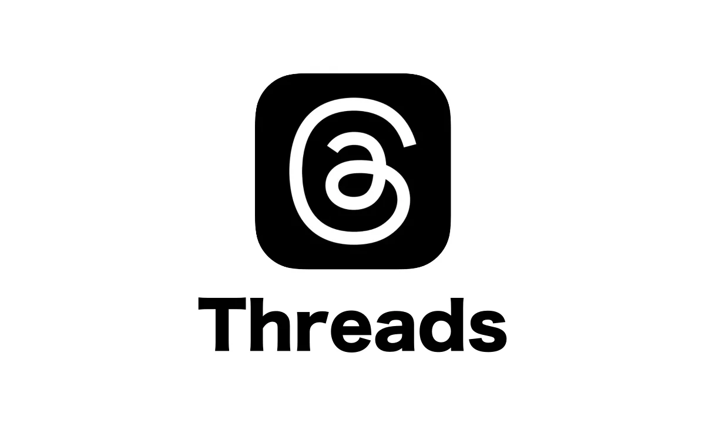

<div style="width: 500px; height: 300px; margin-inline:auto;" >
   
</div>

## Clon de Threads

MiClonThreads es una plataforma de redes sociales diseñada para facilitar la comunicación y la interacción entre usuarios a través de publicaciones breves y mensajes. Inspirada en la funcionalidad de Threads, esta aplicación permite a los usuarios compartir pensamientos, noticias, y actualizaciones en tiempo real, seguir a otros usuarios, y participar en conversaciones.

## Características Principales

1. **Registro y Autenticación**:

   - Los usuarios pueden crear una cuenta mediante un formulario de registro.
   - Autenticación segura con correo electrónico y contraseña.
   - Opción de iniciar sesión con cuentas sociales (como Google o Facebook).

2. **Perfil de Usuario**:

   - Cada usuario tiene un perfil personal que muestra su información básica, publicaciones, y seguidores.
   - Opción de editar la información del perfil y la imagen de perfil.

3. **Publicaciones**:

   - Los usuarios pueden crear, editar y eliminar publicaciones.
   - Las publicaciones pueden contener texto y enlaces.
   - Se implementa un sistema de reacciones (me gusta, comentarios).

4. **Feed de Publicaciones**:

   - Un feed que muestra las publicaciones de los usuarios a los que el usuario sigue, con la opción de ver publicaciones populares.
   - Infinite scrolling para cargar más publicaciones a medida que el usuario se desplaza hacia abajo.

5. **Seguimiento de Usuarios**:

   - Los usuarios pueden buscar y seguir a otros usuarios.
   - Notificaciones sobre nuevas publicaciones de usuarios seguidos.

6. **Interacciones**:

   - Los usuarios pueden comentar en publicaciones y ver los comentarios de otros.
   - Posibilidad de responder a comentarios específicos.

7. **Notificaciones**:

   - Sistema de notificaciones en tiempo real sobre interacciones (nuevos seguidores, comentarios, etc.).

8. **Configuración de Privacidad**:

   - Los usuarios pueden gestionar la configuración de privacidad de su perfil y publicaciones.

9. **Interfaz de Usuario**:
   - Diseño atractivo y responsivo utilizando Shadcn UI y Tailwind CSS.
   - Navegación intuitiva con un menú de acceso rápido.

## Dependencias

- **Next.js 15**
- **Node.js 22**
- **Bun 1.1.0**

## En desarrollo

- Agrega el Eslint de prettier al proyecto

```bash
  bun add -D eslint-config-prettier
```

- Configurado el .eslintrc.json

```bash

add --dev @trivago/prettier-plugin-sort-imports

```

- Crea el archivo para la organizacion de los imports en el .prettierrc.json

```json
{
  "semi": true,
  "singleQuote": false,
  "tabWidth": 2,
  "trailingComma": "es5",
  "importOrder": ["^@/(.*)$", "^[./]"],
  "importOrderSeparation": true,
  "importOrderSortSpecifiers": true,
  "plugins": ["@trivago/prettier-plugin-sort-imports"]
}
```

- Organizador de clases de Tailwindcss

```bash
bun install -D prettier prettier-plugin-tailwindcss
```

- Configurado el .prettierrc.json

```bash
{
  "plugins": ["prettier-plugin-tailwindcss"]
}
```

- No se aceptan cambios en el archivo `.eslintrc.json` o `.prettierrc.json`
- No se aceptan cambios en el archivo `tailwind.config.ts`
- No se aceptan cambios en el archivo `tsconfig.json`
- No se aceptan cambios en el archivo `next.config.ts`
- No se puede modificar los componentes de Shadcn Ui directamente
- Crear colores como variables globales en el archivo `app/globals.css`
- No se usaran archivos de barrels en Next.js

```css
@layer base {
  :root {
    --background: 0 0% 100%;
  }
}
```

- Se acepta el uso de `@layer` en el archivo `app/globals.css` para crear estilos globales

```css
.NameClass {
  @apply bg-red-500;
}
```

- Se acepta el uso de `@apply` en el archivo `app/globals.css` para crear estilos globales

- Se usará Kebab Case para nombrar los archivos nombre-de-la-clase.tsx

- Se Trabajará por Features y Bug Fixes

## Escafolding de archivos

```plaintext

  /mi-clon-threads
  ├── /public
  │   └── (imágenes, fuentes, etc.)
  ├── /src
  │   ├── /components                  # Componentes de UI
  │   │   ├── /common                  # Componentes reutilizables
  │   │   └── /features                # Componentes específicos por características
  │   │       ├── /posts
  │   │       │   ├── post-list.tsx
  │   │       │   ├── post-item.tsx
  │   │       │   └── post-form.tsx
  │   │       ├── /users
  │   │       │   ├── user-profile.tsx
  │   │       │   └── user-list.tsx
  │   │       └── /auth
  │   │           ├── login-form.tsx
  │   │           └── signup-form.tsx
  │   ├── /hooks                        # Hooks personalizados
  │   │   ├── use-posts.ts
  │   │   ├── use-users.ts
  │   │   └── use-auth.ts
  │   ├── /lib                          # Funciones utilitarias y configuraciones
  │   │   ├── api.ts                    # Interacciones con la API
  │   │   └── constants.ts              # Constantes de la aplicación
  │   ├── /actions                      # Acciones para manejar lógica de negocio
  │   │   ├── post-actions.ts
  │   │   ├── user-actions.ts
  │   │   └── auth-actions.ts
  │   ├── /interfaces                   # Interfaces de TypeScript
  │   │   ├── post.ts
  │   │   ├── user.ts
  │   │   └── auth.ts
  │   ├── /app                          # Páginas de Next.js
  │   │   ├── /api                      # Rutas API
  │   │   ├── index.tsx
  │   │   ├── login.tsx
  │   │   ├── signup.tsx
  │   │   └── /posts
  │   │       ├── [id].tsx              # Detalle de publicación
  │   │       └── index.tsx             # Listado de publicaciones
  │   ├── /styles                       # Estilos globales y específicos (Tailwind CSS)
  │   │   └── globals.css               # Estilos globales de Tailwind
  │   ├── /context                      # Contextos de React
  │   ├── /utils                        # Funciones utilitarias adicionales
  │   └── /types                        # Tipos adicionales si los necesitas
  └── package.json


```

### Variables de entorno

Agregar variables de entorno al archivo `.example.env` despues clonarlo en el `.env`

- Se usa `NEXT_PUBLIC_` para variables globales del frontend

```bash
   NEXT_PUBLIC_VALUE=""
```

- Se usa `PRIVATE_` para variables privadas del backend

```bash
   PRIVATE_VALUE=""
```

- Se usa `DB_` para variables de base de datos

```bash
   DB_VALUE=""
```
